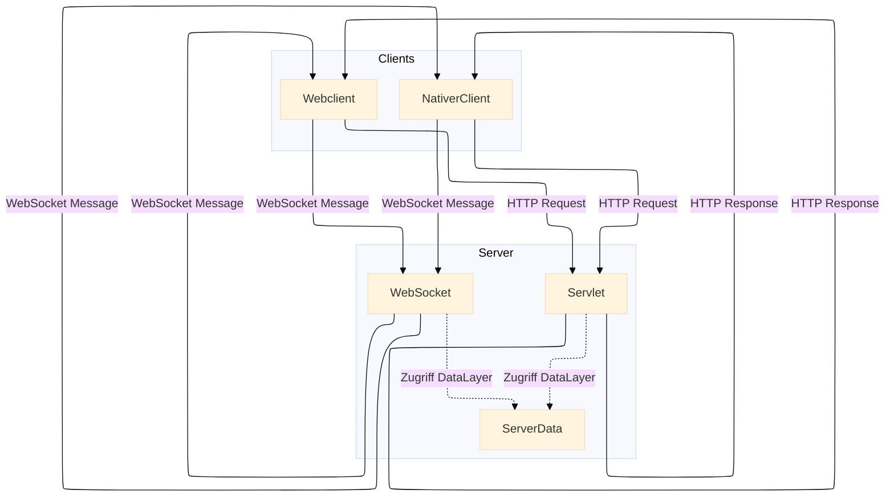

# Vier Gewinnt

## Idee

Beliebig viele Clients können auf einen Server zugreifen und dort gegen andere Clients das Spiel „Vier Gewinnt“ spielen.  Die Clients können Accounts erstellen und sich in diese einloggen.  
Über einen Webbrowser können sie ein Userinterface bedienen, welches mittels HTML und JavaScript erstellt wurde. 
Die im Server eingehenden Nachrichten müssen mit Validierungsdaten vom Client authentisiert werden. Für die sichere Übertragung von Anmeldedaten bei einer Registrierung eines neuen Accounts wird asymmetrische Verschlüsselung mittels RSA-Algorithmus eingesetzt. 
Neben dem Webclient gibt es einen nativen Client, der als Botgegner agiert und automatisch vom Server gestartet werden kann.

## Aufbau der Applikation

Das Projekt besteht aus einer Webanwendung aus Html-, JavScript- und Css-Dateien als Frontend und einem 
Server der sich aus einem Servlet für HTTP Kommunikation und einem Websocket-Serverendpoint zusammensetzt als Backend. 
Im Frontend werden (asynchrone) JavaScript-Funktionen benutzt, um Http- und Websocket-Nachrichten an den Server zu senden und entgegenzunehmen.

### Architektur-Diagramm (Mermaid Flowchart)

## Erzeugung und Nutzung

Die Applikation liegt als Maven-Projekt vor. Es kann in einem IDE (IntelliJ, Netbeans, Eclipse oder VS Code)
geöffnet, editiert und gestartet werden. Das Projekt kann ohne grafisches IDE auch per Maven direkt von der Console erzeugt werden (hier: Linux):

> mvn clean

> mvn package

Die von Maven erzeugte war-Datei kann in einem Tomcat-Server betrieben werden. Für die Nutzung des Bots muss die jar-Datei VierGewinntNativerClientBot-1.0-jar-with-dependencies.jar im Arbeitsverzeichnis des Tomcat Servers vorliegen.

Zugriff auf die App im Browser: http://localhost:8080/VS_Projekt_vierGewinnt/

